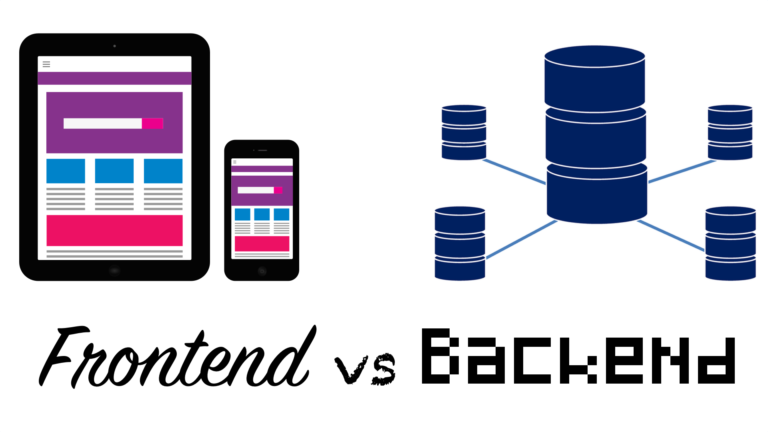

# Premier pas avec NodeJS

<span style='font-size:5em;'>🎆</span>

(il était temps)

<!-- TOC -->
## Sommaire
[Premier pas avec NodeJS](#premier-pas-avec-nodejs)    
- [Premier pas avec NodeJS](#premier-pas-avec-nodejs)
  - [Sommaire](#sommaire)
  - [Web Basics](#web-basics)
    - [Front VS Back](#front-vs-back)
    - [Front-end / Back-end](#front-end--back-end)
    - [Front-office / Back-office ?](#front-office--back-office)
  - [What is Node.JS ?](#what-is-nodejs)
    - [Créateur](#cr%C3%A9ateur)
    - [Chiffres](#chiffres)
    - [Comparaisons des packages disponibles selon les plateformes](#comparaisons-des-packages-disponibles-selon-les-plateformes)
    - [Pourquoi Node.JS?](#pourquoi-nodejs)
      - [Réflexions](#r%C3%A9flexions)
      - [Multi-plateformes](#multi-plateformes)
      - [Une communauté réactive](#une-communaut%C3%A9-r%C3%A9active)
    - [The World of Node.JS](#the-world-of-nodejs)
### Sommaire suite
  - [Development Basics](#development-basics)
    - [Bases](#bases)
      - [JS](#js)
      - [Modules](#modules)
      - [Créer un module](#cr%C3%A9er-un-module)
      - [NPM - Node Package Manager](#npm---node-package-manager)
        - [Commandes utiles](#commandes-utiles)
        - [BONUS - Yarn](#bonus---yarn)
        - [TP 1 - Utiliser NPM pour gérer ses dépendances](#tp-1---utiliser-npm-pour-g%C3%A9rer-ses-d%C3%A9pendances)
    - [Asynchronous Programming](#asynchronous-programming)
      - [Synchronous problem](#synchronous-problem)
      - [Asynchronous solution](#asynchronous-solution)
    - [Callbacks](#callbacks)
    - [Promises ou promesses en bon français](#promises-ou-promesses-en-bon-fran%C3%A7ais)
        - [suite](#suite)
      - [Autres exemples d'utilisation](#autres-exemples-dutilisation)
        - [suite](#suite-1)
    - [Async / await, de l'asynchrone en synchrone](#async--await-de-lasynchrone-en-synchrone)
      - [Utilisations](#utilisations)
        - [Exercice](#exercice)
        - [Correction](#correction)
### Sommaire suite
  - [TP 2 Asynchrones et météo](#tp-2-asynchrones-et-m%C3%A9t%C3%A9o)
      - [Partie 1 - Callback](#partie-1---callback)
      - [Partie 2 - Promise](#partie-2---promise)
      - [Partie 3 - Async/Await](#partie-3---asyncawait)
      - [Partie BONUS](#partie-bonus)
    - [Conclusion Asynchrone](#conclusion-asynchrone)
      - [Final hints](#final-hints)

## Web Basics

### Front VS Back



### Front-end / Back-end

| Front-end                                                                                 | Front-office                              |
| ----------------------------------------------------------------------------------------- | ----------------------------------------- |
| Partie visible de l’iceberg                                                              | Partie invisible de l’iceberg            |
| Design                                                                                    | Gestion de la masse d’utilisateurs       |
| Gestion d’un seul utilisateur                                                            | Mise en place et configuration du serveur |
| Transformation action utilisateur en données compréhensible par le Back-End               | Traitement efficace et rapide des données |
| Transformation données reçu par le BackEnd en informations compréhensible par utilisateur | Conception et communication avec la BDD   |
| Sécurité                                                                                  | Mise à disposition de Web Services        |
| SEO                                                                                       | SEO                                       |
|                                                                                           | Sécurité                                  |

### Front-office / Back-office ? 

**Front-office** = interface utilisateur visible par tous les utilisateurs (connecté ou non)

**Back-office** = interface utilisateur reservé à l'administration d'un site (connecté ou non)

## What is Node.JS ?

### Créateur


**2009 -> Ryan Dahl**

**3 idées**

1. Arrêter avec les entrées et sorties bloquantes (_Event Loop_)
2. Les communautés sont bloquées
3. La portabilité des programmes

Sa réponse ? **NODE.JS**

### Chiffres

En 2018

**8M**

de serveurs à travers le monde

**1st**

Framework le plus populaire (d'après StackOverflow)

**2nd**

Technologie la plus appréciée (d'après StackOverflow)

### Comparaisons des packages disponibles selon les plateformes


### Pourquoi Node.JS?

#### Réflexions

> _Un langage qui n'affecte pas la façon dont vous pensez à la programmation, n'est pas intéressant à connaître_(**Alan J. Perlis**)

**House of many ideas**

- POO VS Fonctionnel
- Typage dynamique VS Typage statique
- Architecture légère VS Architecture Robuste

#### Multi-plateformes

| Plateformes |     |     |     |                                                                                                                                                                                  |
| ----------- | --: | --- | --- | -------------------------------------------------------------------------------------------------------------------------------------------------------------------------------- |
| IOT         | = = | =   | >   |                                                                                  |
| Browser     | = = | =   | >   |                                                                                   |
| Desktop     | = = | =   | >   |                                                 |
| Web server  | = = | =   | >   |  |

#### Une communauté réactive

- 753521 packages sur `npm`

- La communauté ré-invente sans cesse

- Open-source obsessive

### The World of Node.JS


**=> Your project**

## Development Basics

### Bases

#### JS


#### Modules


#### Créer un module

Module = `file`

Choisir ce qu'on veut exporter

Exporting code -> 
```javascript
module.exports = someFunction
```

Importing code -> 
```javascript
require(‘./someModule.js’)

import * as myImportedModule from './someModule.js'

import myImportedModule from './someModule.js'

import { props } from './someModule.js'
```

#### NPM - Node Package Manager

Solution = 10% de votre code + 90% de code de la communauté

1 Module est décrit par :
1. ses propriétés
2. ses dépendances

Description du module => `package.json`

NPM = marketplace des modules

##### Commandes utiles

```javascript
npm init – craft an empty solution
npm install – add new local/online package
npm install <pkg> --save-dev – add package for dev purposes
npm uninstall <pkg> --save – remove a package
npm start – run the application
npm test – test the application
npm publish [tag] – share your app/package with the world
npm run <command> [-- <args>...] – run specific command describe into `package.json`
```

##### BONUS - Yarn

Autre gestionnaire de paquets (by Facebook)

```javascript
yarn init – craft an empty solution
yarn install – add new local/online package
yarn add <package...> [--dev/-D] – add package for dev purposes
yarn add <package...> – add package 
yarn global <add/bin/list/remove/upgrade> [--prefix]– add package globally 
yarn remove <pkg> – remove a package
yarn start – run the application
yarn test – test the application
yarn publish [tag] – share your app/package with the world
yarn run <command> [-- <args>...] – run specific command describe into `package.json`
```

##### TP 1 - Utiliser NPM pour gérer ses dépendances

Dans le cadre du TP, il vous faut installer tous les softs requis pour faire fonctionner l'environnement node.js.

1. Installer Node.JS (https://nodejs.org/fr/download/)
2. Créer un dossier dans votre espace de travail appelé `TP1`
3. Initialiser le dossier grâce au CLI de NPM (peu importe ce que vous saisissez, l'important c'est la génération du `package.json`)
4. Créer un fichier `index.js` à la racine du dossier `TP1` (`<votre_espace_de_travail>/TP1/index.js`)
5. Ajouter la dépendance `console-log-hello-world` à votre projet
6. Utiliser la dépendance `console-log-hello-world` dans le fichier `index.js`
7. Pour vérifier l'éxécution, ajouter un bloque `scripts` dans le `package.json` de la manière suivante: 
    ```javacript
    {
        ...contenu du package.json
        , scripts: {
            <le nom de ma nouvelle commande>: 
                '<le contenu de ma commande>',
        }
    }
    ```
8. Une fois toutes les étapes effectuées, lors de l'éxécution du script, vous devez voir afficher `Hello World`.

### Asynchronous Programming

**KEZAKO?**

Il s'agit de programmer de manière à ne pas bloquer l'action à venir par le traitement en arrière plan de l'action actuelle.


#### Synchronous problem

Node.JS est asynchrone par nature, mais qu'est ce que cela signigie?

Synchrone => éxécuter étape par étape, pour du code ligne par ligne. On attend le résultat courant avant de passer à la suite

```javascript
1. const options = {dbName: orders} //0.1ms
2. const orders = DB.getOrders(options) //8ms
|
|
|
|
3. logger.log(‘orders fetched’) //4ms
|
|
=> Résultat obtenu après 12.1ms
```

Le défaut principal de cette manière de faire réside dans le fait que l'utilisateur est bloqué en attendant l'obtention de résultat.

#### Asynchronous solution

On attend plus cette fois-ci les résultats des actions, mais pour le moment on ne sait pas les récupérer après avoir lancer l'action.

```javascript
1. const options = {dbName: orders} //0.1ms
2. const orders = "Don't wait" -> DB.getOrders(options) //0.1ms
3. "Don't wait" -> logger.log(‘orders fetched’) //0.1ms

=> Résultat obtenu après 0.3ms
```

Pour corriger le problème que pose la programmation synchrone 3 solutions s'offrent aux développeurs.

1. Les Callbacks
2. Les Promises
3. `async`/`await`

### Callbacks

L'idée principale de cette solution est de passer en paramètre de la méthode qui nous fait patienter, la méthode qui sera exécuté à son tour un fois le traitement effectué.

```javascript
const myFunction = (cb) => {
    /**
     * traitement long et fastidieux
     */
    
    cb(args?); // appel du callback en fin de processus
}

// On passe le callback lors de l'appel de notre méthode asynchrone
// Il sera exécuté à la fin du traiment de `myFunction`
myFunction((...args) => args ) 

```

Cela entraîne malgré tout certaines dérives (voir `callback hell` 😉)

### Promises ou promesses en bon français

Pour contourner le soucis des `callback hell`, une solution est née les Promises.
<span style='font-size:1em;'>🧐</span>

Comme son nom l'indique il s'agit de promesses faites entre une méthode et l'utilisateur:

La méthode nous promet de retourner quelquechose et après cela on pourra faire un traitement quelconque.

##### suite

```javascript
const myFunction = () => {
    return new Promise((resolve, reject)=>{
        /**
         * traitement long et fastidieux
         */

        if(err) reject(err?); //gestion de l'erreur
        
        resolve(...args?) // dans le cas d'un succès ou de l'absence d'erreur
    });
}

myFunction()
    .then((...args?) => {...})// en cas de succès (après un `resolve`)
    .catch((...err?) => {...})// en cas d'erreur ou de rejet
    (.finally(()=>{...}))// pour éxécuter du code quoi qu'il arrive
```

#### Autres exemples d'utilisation

```javascript
const myFunction = () => {
    /**
     * traitement 
     */
    
    return Promise.resolve(args?) || return Promise.reject(args?);
}
function otherFunction {
    return Promise.resolve(args?);
}

// On peut enchainer les promises => Promise chain
myFunction(args)
.then(()=>otherFunction())
.then()
...
.then()
.catch()
...
.catch()
```

##### suite
```javascript
// Note: un seul catch suffit pour récupérer les `reject` de toutes les promises précédentes
myFunction(args)
.then(()=>otherFunction())
.then() // Ils sont attrapés par le `catch en cas d'erreur car antérieur à celui-ci
...     //
.catch() 
.then() // Ce `then` n'est pas attrapé
```

Plus d'information => [ici](https://developer.mozilla.org/fr/docs/Web/JavaScript/Reference/Objets_globaux/Promise)

### Async / await, de l'asynchrone en synchrone

Ici, il s'agit de faire de l'asynchrone en écrivant du code synchrone.

Un exemple:

```javascript
// Reprenons le code du début
const options = {dbName: orders} //0.1ms
const orders = "Don't wait" -> DB.getOrders(options) //0.1ms
"Don't wait" -> logger.log(‘orders fetched’) //0.1ms

// Pour garder le fonctionnement et l'écriture tout en récupérant les actions de manières asynchrones
// utilisons `async/await`

//Override de la classe DB
class DB { 
    //on précise que `getOrders` est une méthode asynchrone à l'aide du mot clé `async`
    async getOrders(opts){} 
}

//logger.log est défini comme ceci `async log(params){}`

const options = {dbName: orders} //0.1ms
//on prévient le process node qu'il lance l'action de `getOrders` et qu'il recuperera plus tard les résultats
const orders = await DB.getOrders(options) //0.1ms 
await logger.log(‘orders fetched’) //0.1ms
```

#### Utilisations

Avec l'arrivée de la syntaxe `async/await`, les complexités que pouvaient apporté les callbacks et les promises ont disparues.
On développe toujours de manière synchrone mais juste dans l'écriture.

Dans l'éxécution, en précisant `await` devant une méthode qui a été décrite avec le mot clé `async`, on rend l'éxécution asynchrone sans s'en rendre compte.

Cependant, on peut mélanger les `async/await` avec les `Promises` car de manière interne les méthodes `async` retourne des `Promises` 😉

##### Exercice

Transformez le code ci-dessous contenant des `Promises` en code utilisant la nouvelle syntaxe d'ES6, `async/await`:

```javascript
function getOrders(){
    new Promise((resolve, reject) =>{
        logIn("username", "password")
        .then((user) => {
            getOrdersByUser(user.name)
        })
        .then((orders)=> {
            resolve(orders)
        }
    })
} 
```

##### Correction

```javascript
async function getOrders(){
    const user = await logIn("username", "password");
    const orders = await getOrdersByUser(user.name);

    return orders 
    
    // Ou

    return await getOrdersByUser(
        (await logIn("username", "password")).name
    ); // mais un peu moins lisible
}

// ou encore

const getOrders = async () => await getOrdersByUser((await logIn("username", "password")).name)

```

### TP 2 Asynchrones et météo

Ce TP a pour objectif de vous familiariser avec le développement asynchrone.

Dans ce cadre, nous avons besoin de récupérer la météo d'une ville (le temps qu'il y fait et la température suffiront).

Pour cela, vous devrez utiliser le module `weather-js` disponible sur npm avec sa documentation.

**Intro**: 
1. créer un nouveau dossier et initialiser le à l'aide de `npm init`
2. ajouter la dépendance à `weather-js` au projet
3. créer un fichier `index.js`
4. ajouter la commande `start: 'node index.js'` dans le `package.json`

#### Partie 1 - Callback
Utiliser le module `weather-js` de manière asynchrone en utilisant la méthode de **Callback**.

Objectif => Logger (`console.log`) le *1er* résultat de la météo d'une ville de votre choix, en cas d'erreur le logger aussi.

#### Partie 2 - Promise
Utiliser le module `weather-js` de manière asynchrone en utilisant la méthode de **Promise**.

Objectif => Logger (`console.log`) le *1er* résultat de la météo d'une ville de votre choix, en cas d'erreur le logger aussi.

#### Partie 3 - Async/Await
Utiliser le module `weather-js` de manière asynchrone en utilisant la méthode de **async/await**.

Objectif => Logger (`console.log`) le *1er* résultat de la météo d'une ville de votre choix, en cas d'erreur le logger aussi.

#### Partie BONUS 

1. Permettre le passage de paramètre à la commande de manière à laisser à l'utilisateur le soin de passer sa ville et le type de température qu'il souhaite:
```javascript
npm start Paris C // Pour avoir la température en °Celsius et la météo de Paris
npm start Aix-en-Provence F // Pour avoir la température en °Fahrenheit et la météo de Aix-en-Provence
```

2. Permettre à l'utilisateur de choisir le type d'asynchrone qu'il souhaite effectuer dans la commande:
```javascript
npm start Paris C async // Pour de l'async/await
npm start Aix-en-Provence F promise// Pour des promises
```

### Conclusion Asynchrone

**Callback** => simple de compréhension mais vite complexe à l'usage


####
**Promise** => complexe à appréhender mais très utile


####
**Async/await** => meilleur compromis perf/usage


#### Final hints

Async/await est votre meilleur ami – utilisez-le le plus souvent possible

Pour éxécuter plusieurs tâches de manières asynchrones ensembles, utilisé `Promise.all` (meme avec `async/await`)

Pour éviter les callbacks (too old 👨‍🦳), pensez à `util.promisify`!
